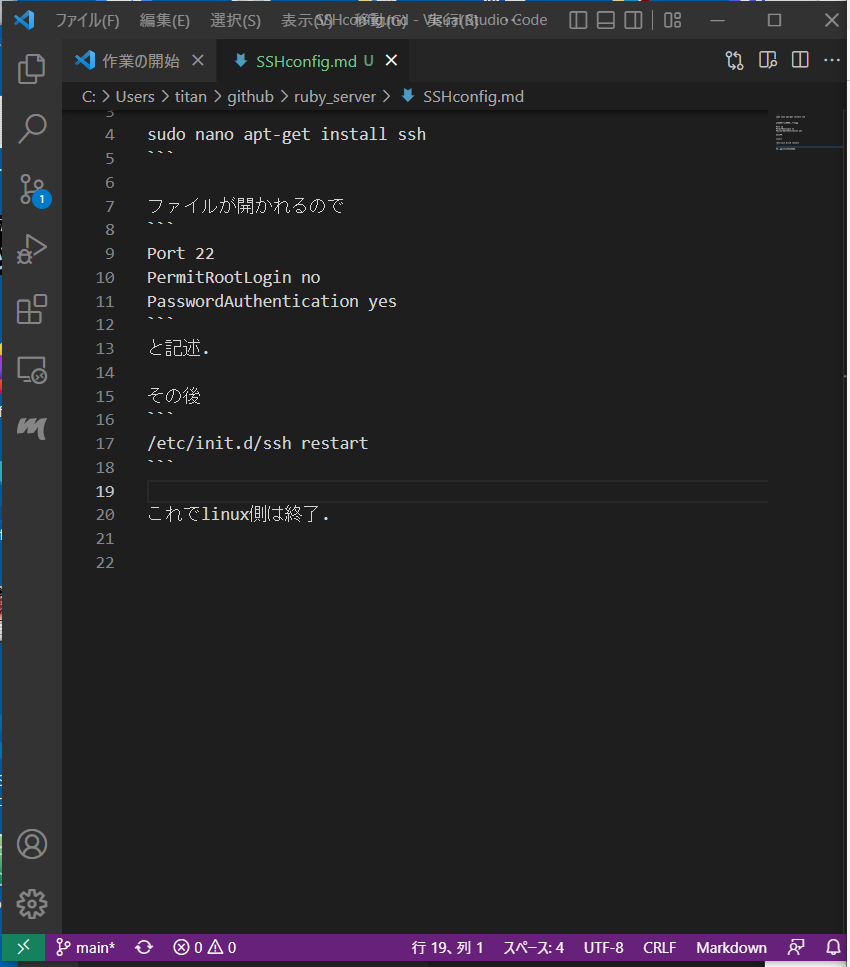
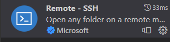
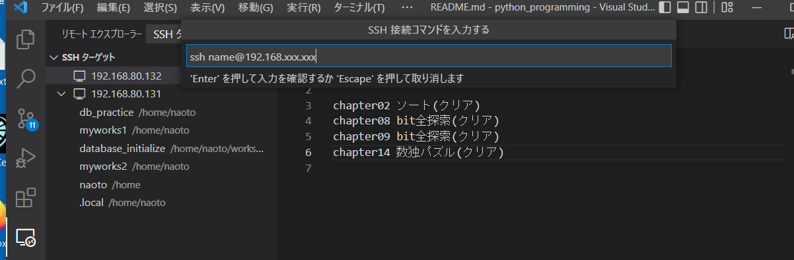

linux側で新規ユーザの作成

newuser,password部分を作りたい名前,パスワードに置き換えるべし
```
sudo useradd -m newuser

```

newuserにパスワードを設定
```
sudo passwd newuser
```
カーソルが動かないが,きちんと入力されてます.


```
sudo nano apt-get install ssh
```

ファイルが開かれるので
```
Port 22
PermitRootLogin no
PasswordAuthentication yes
```
と記述.

その後
```
/etc/init.d/ssh restart
```


```
ifconfig
```
と入力してIPアドレスをメモしておく.

これでlinux側は終了.


# VScode

拡張機能
(画像でいうと11,12行目らへんの正方形が4つあるマーク)

でRemote-SSHをインストール.

画像1
<p></p>

画像2 Remote SSH
<p></p>

画像1の左下の緑部分をクリック.


ホストに接続.新規SSHホストを追加する.先ほどメモしたIPアドレスを使用.

192.168.xxx.xxx

ホストが追加されました　とでる.

画像3のようにリモートエクスプローラー(左のパソコンマーク)
```
select the platform of the remote host "192.168.xxx.xxx"
```
で設定.

メモしたIPアドレスを使用する.
(私の場合はIPアドレス192.168.80.132となっている.)
sshターゲットでユーザ名の設定を行う.

画像3
<p></p>

接続時にパスワードを求められるので入力. 接続できる.


## 参考文献

- https://eng-entrance.com/linux-user-add
- https://www.mathkuro.com/vs-code/remote-development-in-offline/
- https://qiita.com/nlog2n2/items/1d1358f6913249f3e186