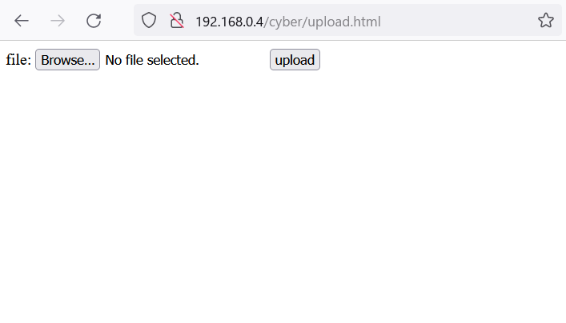
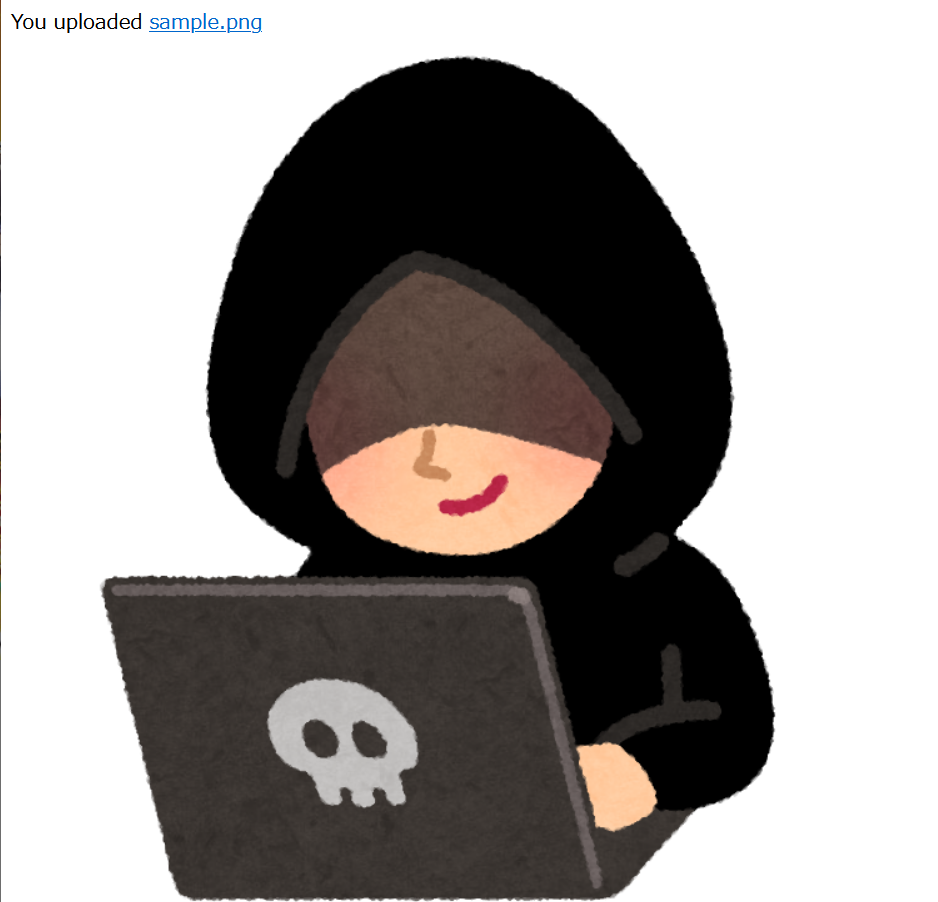
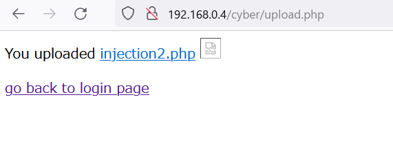
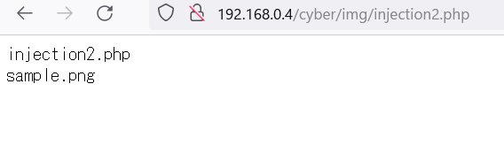

# How to configure php and apache2 on raspberrypi

筆者の環境ではOSバージョンは
```
uname -a 
Linux raspberrypi 5.15.32-v8+ #1538 SMP PREEMT 
```
でした.

```
sudo apt-get --purge remove php*
sudo apt-get install php php-xml
apt install apache2 libapache2-mod-php7.3

sudo systemctl restart apache2
```


参考文献
- https://qiita.com/mono_taro/items/9a6af3f3f8fb14ba27aa
- https://www.tokyo2show.co.jp/raspi/raspiserver.html


# OSコマンドインジェクション


/var/www/html/というディレクトリ下にcyber というファイルを作る.

さらに cyberというディレクトリ下に/img/というディレクトリを作る.

以上の操作があるが,
同じディレクトリにあるcyberをそのまま/var/www/html/に入れればよい.

なお,/var/www/html/下にファイルを作る際には管理者権限が必要なので,適切な処理をする(sudoなど).

つづいて,imgディレクトリに権限を持たせる.
これはphpの関数move_uploaded_file() の第二引数のディレクトリには管理者権限が必要だからである.

以下のコマンドを打つ.
```
sudo chmod 777 img
```
apacheを起動させた状態でwebブラウザ上で以下の操作をする.
```
ラズパイのIPアドレス/cyber/upload.hmtl
```
画像1
<p></p>

筆者の環境ではラズパイのIPアドレスが192.168.0.4となっている

IPアドレスについては
```
ifconfig　
```
コマンドで確認できる.

sample.pngをアップロードすると　アップロードした画像が表示される.(画像2)

画像2
<p></p>


injection2.phpをアップロードすると,アップロードしたファイルが出てくる.(画像3)


画像3
<p></p>


ここで,injection2.phpをクリックすると...
攻撃が成功する

画像4
<p></p>


injection1.phpについては自分でやってみてください.

暗号化されたデータを復号させるためにはjohn the ripperが必要になるはず.

## 対策
- そもそもディレクトリトラバーサルをさせないことも大事.
- 拡張子でアップロードするファイルの指定(万全ではない)
- アップロードされたファイルが公開ディレクトリに保存しないようにする.(/var/www/html/下が公開ファイルになってしまう)

参考文献
- http://into.cocolog-nifty.com/pulog/2014/02/post-c56e.html
- https://kazmax.zpp.jp/linux_beginner/etc_passwd.html


## 予備
授業デモ扱う予定のapacheで実行予定のものは
- セキュアなほうのファイルは
/var/imgCyber　下に配置
- 脆弱なファイルは公開ディレクトリ
/var/www/img
に配置しています.
(必要ならばディレクトリを作るべし)

apahceの起動と停止
```
sudo service apache2 restart
sudo service apache2 stop
```


